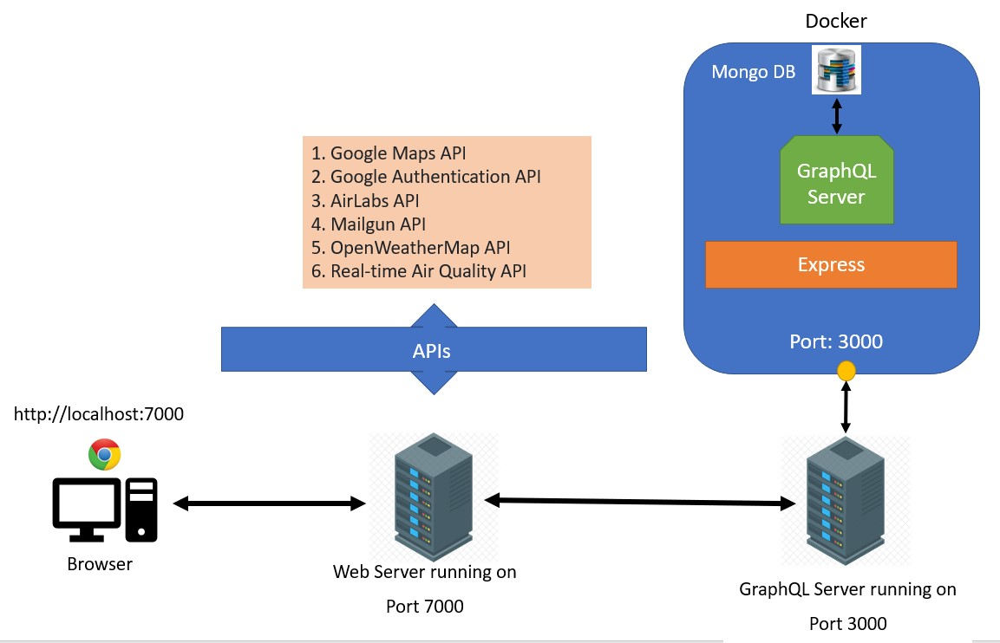

# AeroWeather: IT5007 Team2 Group Project

## Introduction
Welcome to AeroWeather, an innovative social platform designed for travellers. Combining essential travel services with social connectivity, AeroWeather provides a unique, integrated experience for journey planning and sharing.

## Novelty:
AeroWeather stands out as an innovative social platform tailored specifically for travellers, integrating essential travel services with social connectivity. This one-stop website offers a personalized experience, allowing users to create their own accounts where they can seamlessly search and save flight information. What sets AeroWeather apart is its interactive map feature, powered by Google Maps, which not only displays flight paths but also provides real-time tracking. This functionality transforms the way friends and family stay connected during travels.

Members can easily add other AeroWeather users to their network, fostering a community of travel enthusiasts. Sharing flight details with friends is not just about keeping them informed; it’s about sharing experiences, as friends can visually track each other's journeys in real time on the map. This feature enhances the sense of companionship, even when miles apart.

AeroWeather is more than just a flight-tracking social network. It's a comprehensive travel assistant, offering detailed weather forecasts and air quality reports for destinations worldwide. This feature ensures that travellers are well-informed about their destinations, helping them plan their journeys more effectively. Whether it's a sunny holiday or a business trip, users have the convenience of accessing up-to-date weather and environmental information at their fingertips.

The synergy of these features - flight tracking, social connectivity, and environmental awareness - makes AeroWeather not just a website but a holistic travel companion, catering to the modern traveller's needs for information, connectivity, and ease of planning. AeroWeather is where journeys are shared, tracked, and celebrated in a vibrant, interactive community.


## APIs Utilized
AeroWeather integrates several APIs for comprehensive functionality:
1. **Google Maps API:** For map integration and flight path visualization.
2. **Google Authentication API:** Facilitating user sign-up and sign-in processes.
3. **AirLabs API:** To provide real-time flight tracking information.
4. **Mailgun API:** Used for sending emails to users.
5. **OpenWeatherMap API:** Offering up-to-date weather forecasts.
6. **Real-time Air Quality API:** Providing air quality indices wordwide.

## Solution Arhitecture:


## Competitive Analysis:
AeroWeather incorporates several advanced features in the domains of user services, flight services, weather services, and air quality services. Here is an overall competitive analysis considering similar services offered by other platforms:

**User Services:**

Google Authentication API: Many websites offer Google sign-in for convenience. It's a standard feature that enhances user experience and security.
Friend Management and Sharing Features: Social aspects, like adding and deleting friends, and sharing flights, are less common in typical travel or flight-tracking services. These features add a unique social dimension to AeroWeather, differentiating it from more traditional flight or travel websites.

**Flight Services:**

FlightAware: Offers social sharing features, allowing users to share flight-track images before, during, and after flights.

Flighty: An app that provides a private social network for tracking and sharing flights with friends and family, streamlining the process of keeping tabs on loved ones' flights.

FlightStats: A popular app for real-time flight tracking.

These services indicate a growing trend in integrating social sharing and real-time tracking in flight services, which aligns with features offered by AeroWeather.

**Weather Services:**

Weather Underground's WunderMap: Provides interactive weather and radar maps for global locations, which is similar to AeroWeather’s feature of displaying weather information on Google Maps for any city.

AeroWeather platform’s integration of weather services with flight and location information offers a more comprehensive user experience compared to standalone weather platforms.

**Air Quality Services:**

AirNow: Offers air quality data and highlights local area air quality, with broader state, national, and global views.

Google Maps Air Quality API: Expands on the air quality layer with detailed data, pollution heat maps, and more.

IQAir: Tracks air quality and pollution levels in real-time, with a focus on comprehensive summaries and analyses, including worldwide air quality maps.

Incorporating real-time air quality data on Google Maps within AeroWeather aligns well with current technological trends and user needs for environmental information.

**Overall Analysis:**

AeroWeather is in a strong competitive position, especially in terms of integrating multiple services (flight tracking, social sharing, weather, and air quality information) in one platform. The integration of these features is not commonly found in a single platform, which gives AeroWeather a unique edge in the market. The key competitors in each service area indicate a trend towards more integrated, real-time, and socially connected features in travel and environmental information services. AeroWeather website's combination of these elements caters to a growing demand for comprehensive, one-stop solutions for travel planning and environmental awareness.

## Features:
**1-	User Services:** 

    a.	Sign up/Sign in using Google Authentication API (Pull user information: name and email from google account)
    b.	Sign up/Sign in using any email
    c.	Add friends that are on the platform
    d.	Delete friends from platform
    e.	Share user flights with friends
    f.	Save info on local storage to prevent signing out when refreshing page
    g.	Display user profile information
    h.	Sign out

**2-	Flight Services:**

    a.	Search for any flights using Airlabs.co Flight API
    b.	Display all airports within any region on Google Maps
    c.	CRUD flights for a signed in user
    d.	Display friends flights (that were shared)
    e.	Track friends flights on  Google Maps that were shared using real time data
    f.	Share flights with friends and send email notification to the friend about shared flight
    g.	Store flights search history and display same result once clicked on
    h.	Display notifications if flight is within next 24 hours

**3-	Weather Services:**

    a.	Search for any city on  Google Maps and display the weather information
    b.	Store weather search history and display the past 7 days weather of the city, once clicked on

**4-	Air Quality Services:**

    a.	Display real time air quality of locations on  Google Maps.


## License
This project is licensed under the MIT License - see https://github.com/IT5007-2310/course-project-team-2/blob/main/LICENSE.txt for details. If we were to commercialize AeroWeather, we will register for Copyright license.


## Setup

### Setup GraphQL Server in Docker Container
1. Clone repo into Docker container.
2. Get into the server folder.
3. Execute ```npm install``` to install all dependencies in Docker container.
4. Get into the scripts folder.
5. Execute ```mongo flightTrackerdb initmongo.js``` to initialize the database.
6. Execute ```npm start``` to start the GraphQL Server.

### Setup Web Server (developed using Create React App) in Windows Machine
1. Clone repo into a Windows machine.
2. Get into the main/top level directory.
3. Execute ```npm install``` to install all dependencies in Windows machine.
4. Execute ```npm start``` to start the Web server.
5. Browser should automatically open a page with address http://localhost:7000. If not, open a browser manually and go to http://localhost:7000.

### Note: Free AirLabs API
The free API key for AirLabs has limited data and supports up to 1,000 queries only. With the high number of flights departing and arriving Changi Airport, it may hit the maximum limit for the free plan, if the air tracker mode is continuously turned on.
